#  Week 1 - Embedded System Development Components

## Week Objectives
> Classify the parts of an embedded systems developer’s Source Configuration Management (SCM).  
> Apply Git Version Control to software projects.  
> Write a simple programming assignment that prints statistics to the command line using a variety of c-programming operators and features.  
> Perform Compilation with GCC and execute output files from the command line.  
> Use git Version control to create a repository to version control code.  

## Table of Contents
* [Introduction to Software Configuration Management](#introduction-to-software-configuration-management)
* [C Standardization and Team Coding Standards](#c-standardization-and-team-coding-standards)
* [Development Environments Overview](#development-environments-overview)
* [Development Kits and Documentation](#development-kits-and-documentation)
* [Version Control](#version-control)

## Introduction to Software Configuration Management
- SW configuration management (SCM) is the process that handles how we configure and go about developing the code for the project.
- SCM simply describes how the software is developed and organized.
- This process contains a diverse set of goals and guidelines that dictate the software processes just as: 
  - Version Control.
  - Development Process.
  - Environmental Information.
  - Software Build and Release.
  - Software Review.
  - Testing.
  - Support.
  - Defect Tracking.
  - Task Management.

- These guidelines help coordinating the schedule and deliverables of the team.
- Defining the practices of an SCM is dependent on the company or the team itself, as well as the platform needs. (a team may have some specific testing practices while other team implements all of their code in assembly).
- Version control is a very powerful tool that allows are changes in a software code to be tracked indefinitely, `version control` is usally combined with `software review` as a way to prevent poorly designed software configurations into a project.
- As we already know, the embedded system design and development is done using both host machine and target platform, the following image shows some of the important software tools used in the host machine.

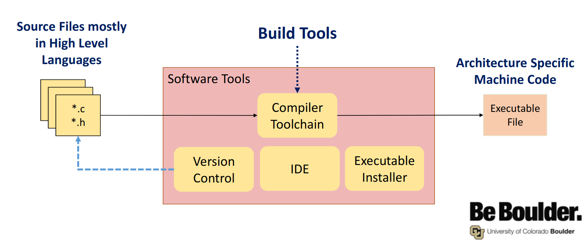

- After the executable file is generated from the toolchain, the code is installed on the target platform through the `programmer debugger` or `burner`.

- We can simulate and test the code on the host environment before installing the code on the target, but it's also crucial to test the code on the embedded platform.
- As the software projects grow heavily (e.g.: as in companies like Apple or Google), they make the guideline so called `software support`, this is to support multiple versions of their product over multiple hardware platforms.
- For example, consider the Apple's iOS support matrix that supports many different ARM core processors and Apple devices with multiple OS versions, some of those devices are not supported anymore and some others are fully supported.

- We know that products eventually will retire and become obselete, but we need these obselete products for not only historical information, but also for validation against newer products, we call these old systems `legacy systems`.
- A system becomes 'legacy' if its software or hardware is outdated, the compatibility between the system components is lost, the system parts are not in production any more, or the company has moved off the roadmap and is actually not supporting the product anymore.

- Using the legacy system as lessons learned and reusing them will speed up the development of the future products.

## C Standardization and Team Coding Standards

### C Standardization
- Software languages are evolving over time (just like software applications do), new versions of the same programming language and hence new features will be released, so software teams need to have an understanding of the language version they use, specially if the project is to be maintained for an extended amount of time.
- An important characteristic of a high level language (like the C language) is that it's standardized and portable across platforms.
- The IEEE, ISO, and ANSI are three groups that evolve with the process of standardizing, which -in turn- help the engineers creating their portable and maintainable projects without much overhead.
- The first unofficial standard of C language was created in the late 1970s, this classic version of C was referred to as `K&R C` which stands for the standard creators Ken Thompson and Dennis Richie, this standard has some features that are no longer supported in C anymore.
- In 1989, the ANSI-C standard was introduced (also known as C89 standard).
- In 1990, the ISO-C (C90) has come to the light.
- In 1999, the C99 came out with some new features (e.g.: the `inline` keyword which is used heavily in embedded systems).
- In 2011. the C11 is introduced, supporting many features specifically related to multi-threding.
- It's crucial to know about these standards diversion as many compilers can support only specific versions, even some compilers can support only one version of C, so we may be forced sometimes to use particular compilers to get the job done.
- However, there are not many differences or changes between the C89 and C99 standards.
- We specify the standard version during compilation process.

### Team Coding Standards
- A coding standards or coding guidelines are simply a list of software guidelines to be followed during the code development throughout the project.
- There maybe a special format and documentation for the code needed, you may need to program the flow of routines in a certain way, how you name files, functions, and variables, etc...
- The importance of the coding standards becomes obvious when a wide range of a team consisting of senior and new hired junior engineers work with each other, needing consistency in the code base to reduce the possibility of syntax bugs or bad practices.
- Another strength point of the coding standards is that it greatly enhances the code readability.
- Can also ensure security, portability, reliability, and safety of software.
- A very common C programming guideline for embedded systems is the Motor Industry Software Reliability Association MISRA-C.
- Another guideline is the Ganssle’s “Firmware Development Standard”.
- Also the company's software team can develop their own specific coding guideline based on their requirements.
- Team members come and go over time, but the company must ensure quality and maintainability of their products along their lifetime, that's why the coding guidelines are crucial for them.
- The following image shows a code example written with the Ganssle's firmware development standard.

- The above images shows a block of comments at the top of the file that discuss file name, some copyright information, authorship and description of the module. This header section provides the information that can save the developer a lot of time tracking down the code.
- The copyright is very important for the software engineer to read and understand, specially when the engineer consider adding third party software in their project.
- Including third party software without checking its copyright can cause major issues, as copyright infringement may lead you to loss of your code ownership and other legal serious issues (e.g.: Cisco systems had to opensource some of their firmware of their products due to a violation of a software foundation license).
- After the heading block of comments comes the function prototype with a very informative commented section, indicating a function description, parameters and return type.

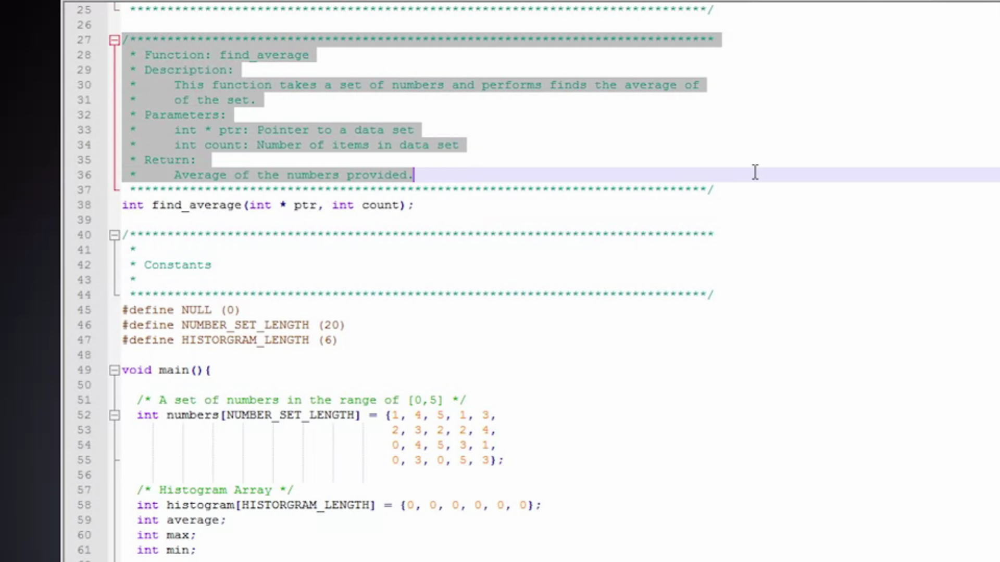

- Usually, these comments are only included in the header file, as the header file may be the only thing a software engineer has access to when interfacing with the software which has its implementation files pre-compiled.
- Constant information are represented in CAPITAL letters as shown below:

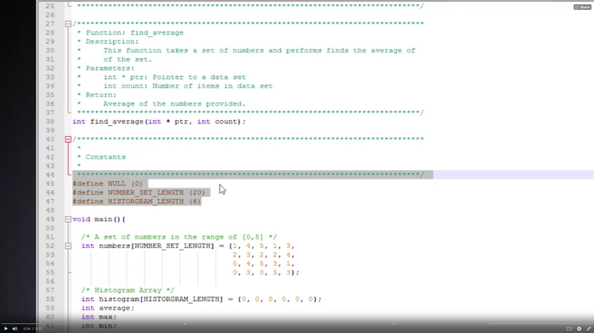

- Indentation and new lines are used to help with readability like the array in the above image.
- In indentation, it's better to use `spaces` over `tabs` for consistency as each editor specifies how long a tab actually is.

## Development Environments Overview
- The primary goal of the development environment is to allow developers to write, compile, install, and debug the program.
- There are two different desktop environments that can be used in development:
  - The command line interface (CLI) (specially in linux machines).
  - The integrated development environment (IDE).
- Building software project using the CLI is a very useful skill as it gives us a powerful level of control of applications, but at the expense of the user interface.
- In this course, we will deal with the CLI in order to:
  - Edit Code.
  - Build.
  - Install.
  - Debug (will not use it in the course).
- For compilation, we will use GNU toolset to generate the SW executable files.
- Installation and debugging are architecture dependent processes, `host debugging` can utilize a command line tool called `GDB` which stands for `GNU project debugger`.
- On target debugging can be done through a `network debugger` or `connected hardware debugger`.
- The IDE encapsulates all the above complex details and provides a much more interactive user interface to make it easier to finish the job, but since the IDE hides some details from the developer, then it restrics the developer's degrees of freedom which becomes less ideal for them to work with IDEs.
- However, IDEs basically run behind the scenes the exact same commands as the commands we use in the CLI, the IDEs have some minor differences for automation purposes that we will consider when we talk about make files later in the course.
- Some basic Debian/Ubuntu Linux command line commands are:
  - pwd ==> shows the location of the present working directory.
  - ls ==> list all of the current directories and files that are in the current working directory.
  - cd ==> change directory, this command changes the current working directory to another one.
  ** Please note that I'm not focusing on illustratring linux and command line details, so if you are interested in understanding please refer to the course or any linux supplementary material. **
  
## Development Kits and Documentation
- It's not easy to design your own hardware as it requires a lot of experience, time, hardware bugs fixing, so we usually begin our projects using evaluation kits that are generic hardware platforms that come with different versions and specs. After we successfuly implement the proof of concept, we may start designing our own PCB (or we may implement the proof of concept in parallel with designing the hardware).
- Whether we choose to use evaluation kits or design our own hardware, we need to choose a specific microcontroller chip to deal with.
- Determining to pick a particular microcontroller chip is not random and is not easy as it depends on the features we want in our application, some of those features are:
  - Word size.
  - Numer of registers in the microcontroller.
  - Flash/RAM sizes.
  - Branch prediction support.
  - Instruction/data cache support.
  - Floating point arithmetic support.
  - DMA support.
- Those features affect the operation and performance of our embedded application, so it's necessary to choose the target platform wisely.
- We may need to ask ourselves some questions to help choosing a suitable chip:
  - How much memory will I need for my application?
  - How fast does my application needs to run?
  - What kind of mathematical support do I need?

- The process of creating the features and operation requirements checklist is called a `specification` or `feature specs`.
- Finishing the specification process, it's the time to choose the suitable microcontroller chip.
- Many microcontroller families do exist and each family shares the same chip architecture, each processor family has its subfamilies which have more differences in supported hardware, hence each subfamily has different features from other subfamilies, and each subfamily has different devices or part numbers, each device varies slightly from the other device in the same subfamily.
- For each family, a `selector guide` is created to help us choosing the most appropriate device from the most appropriate subfamily as the selector guide states the differences in features between each device, for example, consider the following image showing the selector guide for the KL2x family:

- After getting some information from the selector guide and highlighting some devices to consider, we then obtain some more information using the `product brief`, this gives us a concise overview and features specs for a quick evaluation of a platform, it has more details than what we see in the selector guide, an example of the product brief is shown below:

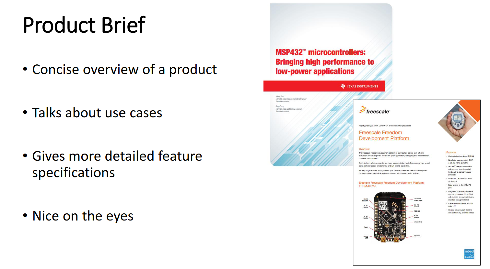

- Now we have a short list of the microcontrollers to choose from, it's the time to get much more detailed documentation sources as the `datasheet`.
- The datasheet provides the technical specs of a chip or a family of chips, the pinout diagram, and operation specifications like the electrical, timing, environmental specs.
- In the electrical specs, we find information about the voltage and current operating ratings, power specs in various conditions and operating modes.

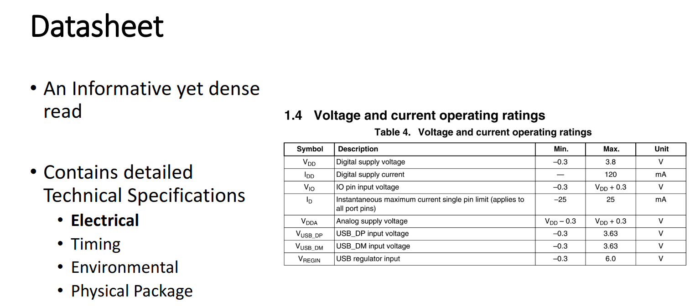

- In the timing specs, we find info about the timings of different modes, the limit of the processor clock frequencies, timing diagrams showing expected time delays before certain digital signals are asserted to take into consideration while developing the application.

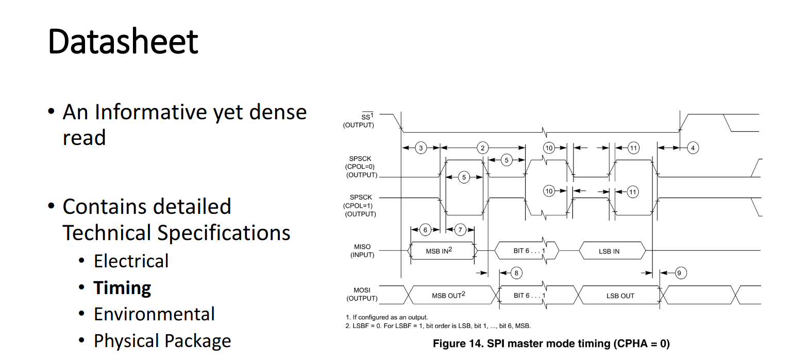

- The environmental specs shows how the environmental conditions affects the opertaiton of the microcontroller such as the temperature operating requirements.

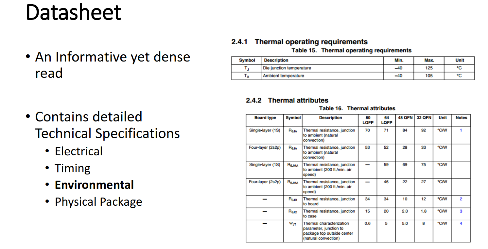

- The physical specs shows the physical design constraints, such as the pinout diagram, dimensions and footprints of the chip.

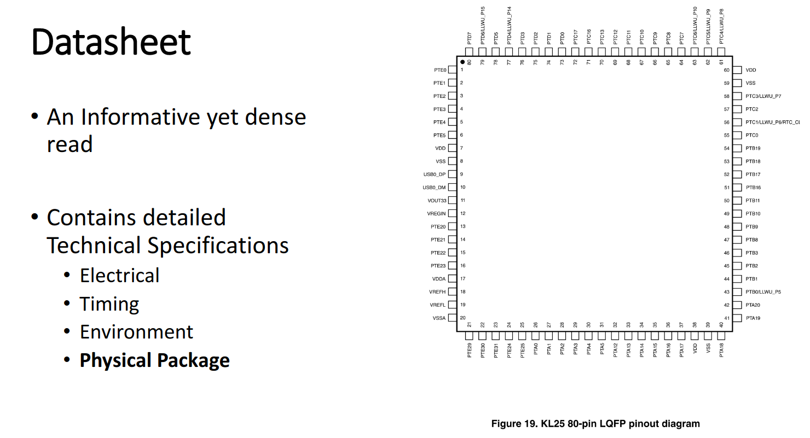

- The datasheet may not provide information on configuration, if so, then we find these information in the `reference manual` which describes the configuraion details, and how to write the bare-metal firmware for the chip.

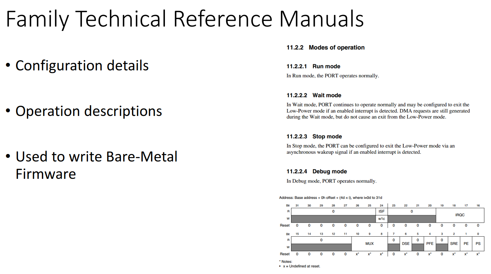

- Sometimes there are issues with the product after releasing or missing details, these issues and missing details are documented in the `chip errata` as well as additional and corrective information for the device. It's important to refer to the errata if we saw something is operating unexpectedly with the chip.

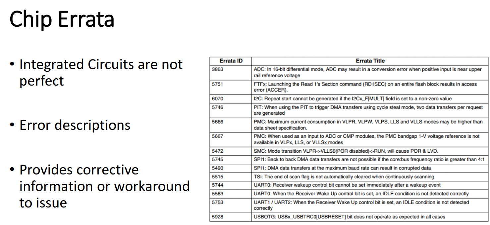

- Some boards have on board programmer/debugger support, which may be a secondary processor which is used to run as an onboard programmer/debugger adaptor that can flash the target processor, this adaptor is called `openSDA`  which has a specialized, dedicated connection to the processor target for debug support and chip programming:

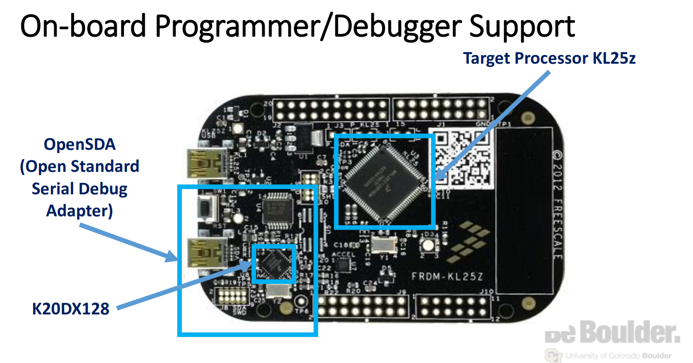

- An example of an on board programmer/debugger schematic is the one in the KL25z kit, we interface it with our host machine through a USB cable and by installing with a special IDE for this processor:

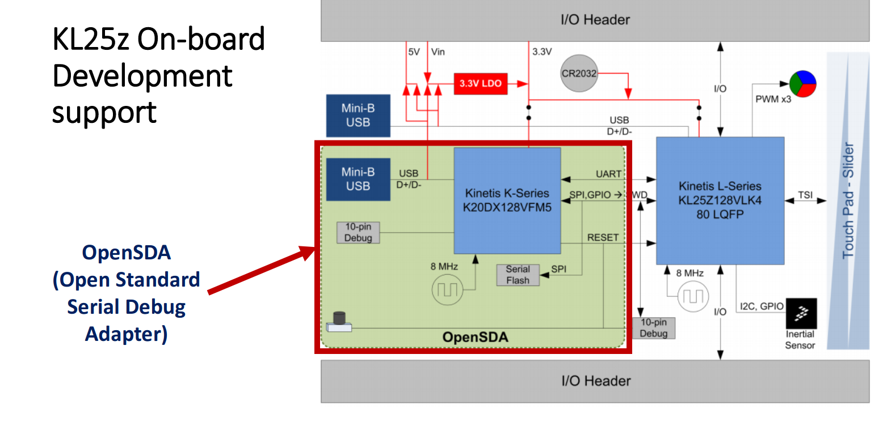

- Another example is the Texas Instruments' MSP432 launch pad which has an on-board emulator and energy trace technology which evaluates the energy uses in the target processor during the application, as well as installing and debugging:

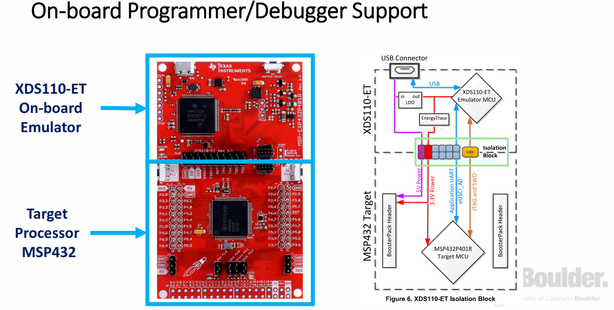

## Version Control
- Version control system (VCS) or revision control system (RCS) is a software used to track the software changes in a project, it is a method to see every change we make to our software instead of just saving the new file over the original file so that we can review both the latest changes and the very old changes.
- The VCS gets installed on the host machine where we develop the code.
- The VCS allows you to track items such as:
  - Software.
  - Documentation.
  - Build configuration information.
  - Software configuration information.
- There are many different types of version control systems like:
  - Concurrent Versions System (CVS).
  - Subversion (SVN).
  - Mercurial.
  - IBM Rational ClearCase.
  - Git.
- We will use Git in this course.
- Git is widely used and has become an industry leader in VCS.
- The VCS system appears like a normal file system full of source and header files organized in some arbitrary folder structure, the following images shows the structure of a git system in both windows and linux perspective:

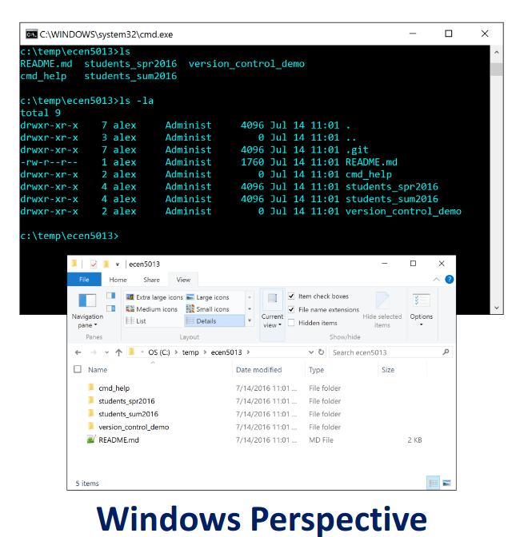
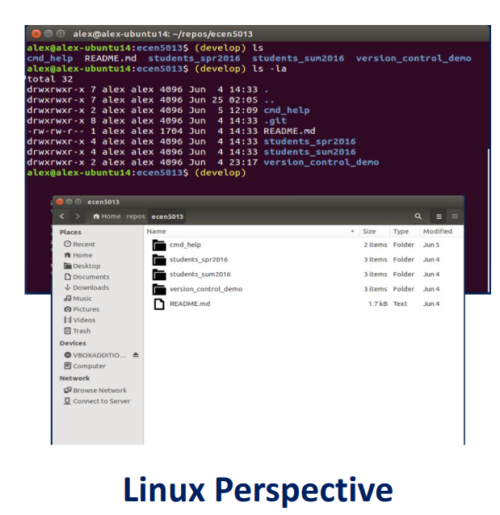

- There are also hidden files in a directory named (.git) that contain the configuration and tracking information for our code that is managed by the VCS system, those files shouldn't be modified by the user as all changes and interactions should be done by git commands.
- The collection of those software project files and version control files is called a `repository` or `repo` for short.

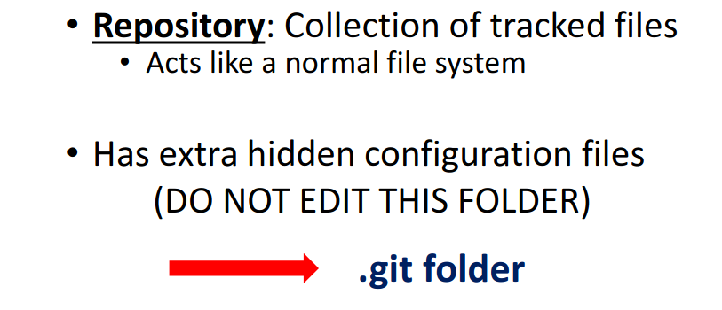

 - Although each repo represents a project, we can combine multiple repos to be components of a single large project like the android phone project shown in the image below:

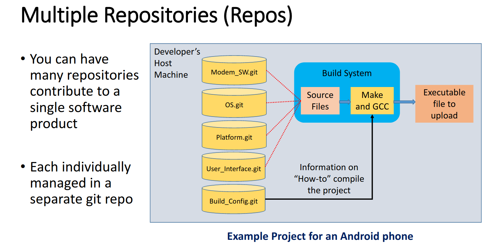

- Each historical change that is tracked is called a `commit`, these tracking info are called `metadata` and it includes informative items such as:
  - The username and E-mail of who made the change (committer).
  - Data of the change.
  - File change list.
  - Informative comment that briefly describes the commit.
  - Unique SHA-1 ID used to identify this commit in the repository.
    > The SHA-1 ID is a 40 character unique ID assigned to every commit you make, by this SHA ID we can refer back to any commit we want alongside the repo and see what was changed and by who. 
  - The commit parent, which is the commit before the current changes.

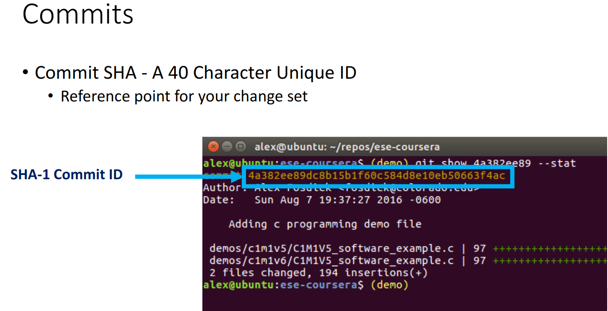

- In order to reduce data overhead, git allows the commit to store just the information on the changes between the current version to be committed and the previous one -which is called the parent commit-. In other words, git is actually tracking the deltas or the changes between each successive commit, meaning that not all files are updated in each commit, just the changed ones.

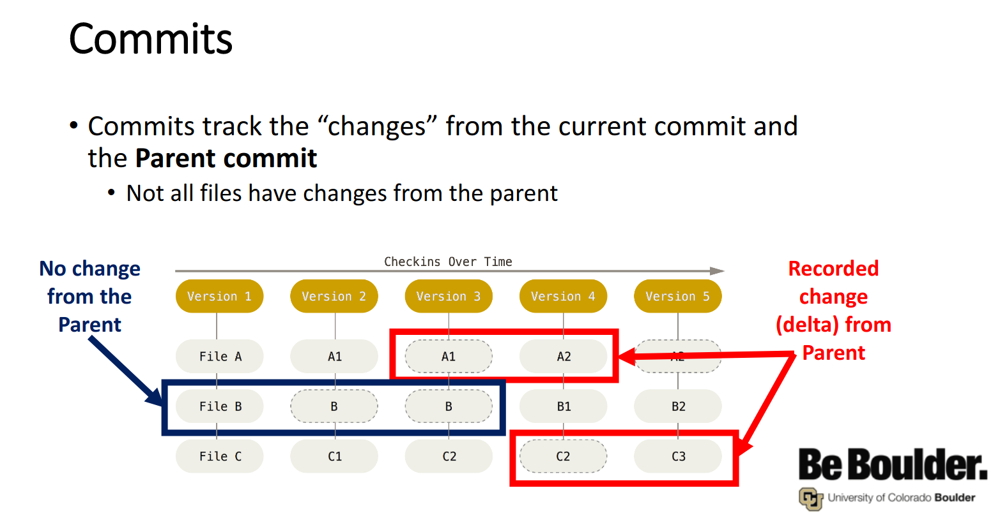

- We can see all the commits in the repo starting from the first commit to the last one by using the command `git log`, this command shows little metadata about each commit as shown in the following image:

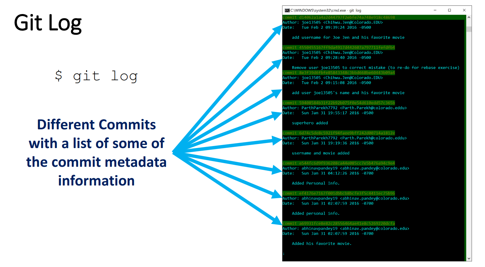

- By default, we have the repository on our local host machine, hence all changes we make to the repository remain local on just our host machine.
- Then we need to "push" our changes to the remote (origin) repository where all teammates can see these changes.
- If I want to download the current remote repo to my local host machine then I should "pull" or "clone" this repository to my machine.

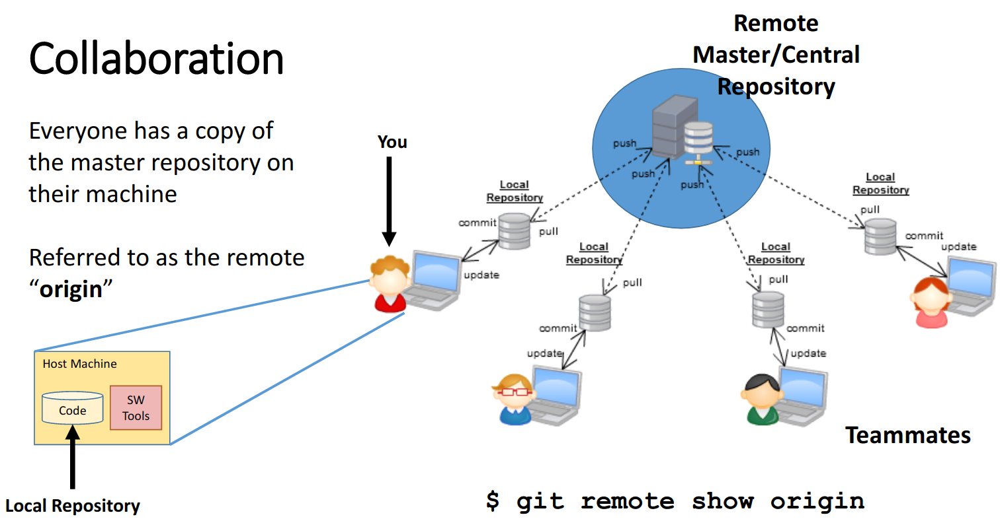

- We consider other teammates' local repos as a remote repo too, so I can pull from local repos and push to their local repos.

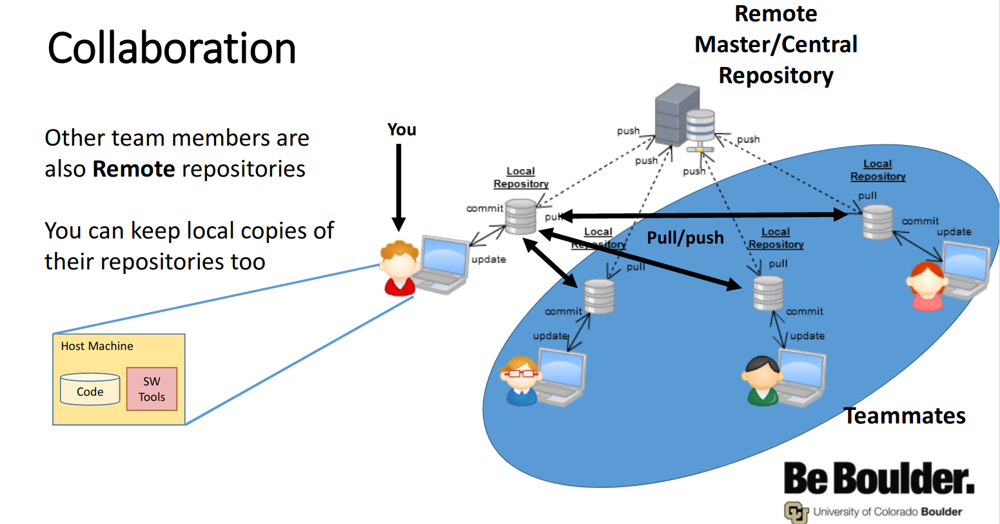

- Companies may store the repo privately on their internal servers to protect their intellectual property, and may open-source the project and make the repo available on repository store sites such as:
  - Github.
  - BitBucket.
  - SourceForge.
- If I'm creating a new repo, I do so by the command `git init`, this creates a local repository on my machine.
- We may want to make some changes without affecting the current code base which is the `master branch`, we can create another development branch. A branch is just a way to organize your changes and indicates that you are diverging from the main line of development, we can name the branch whatever we want and we can have as many different branch as we want.
- Branches are used to track different features and bug fixes without affecting one another.

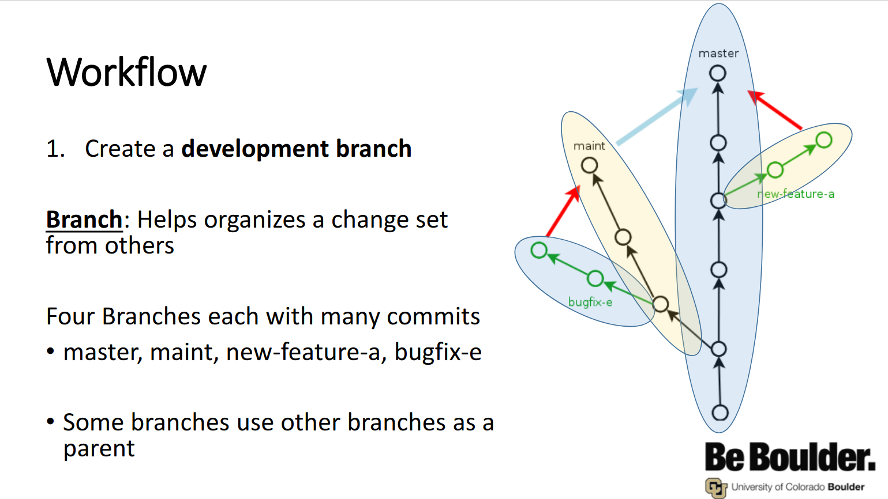
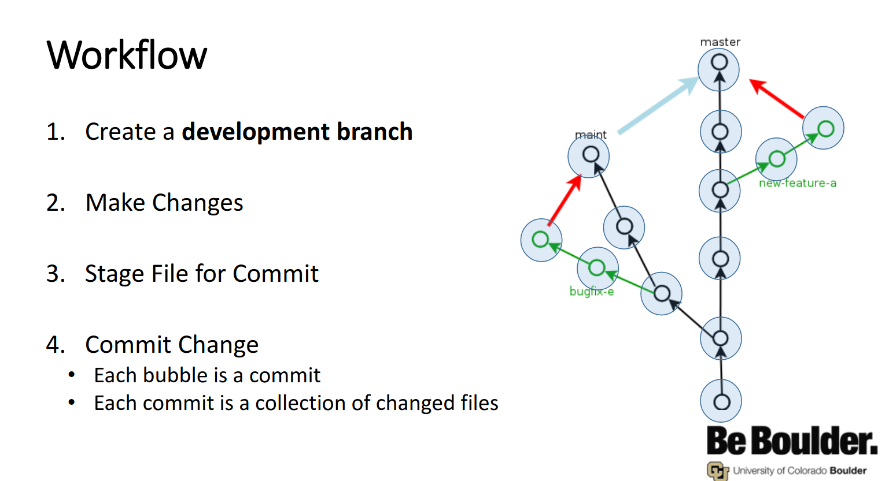

- Consider the following image regarding what actually happens starting from making a new file to finally commit it:

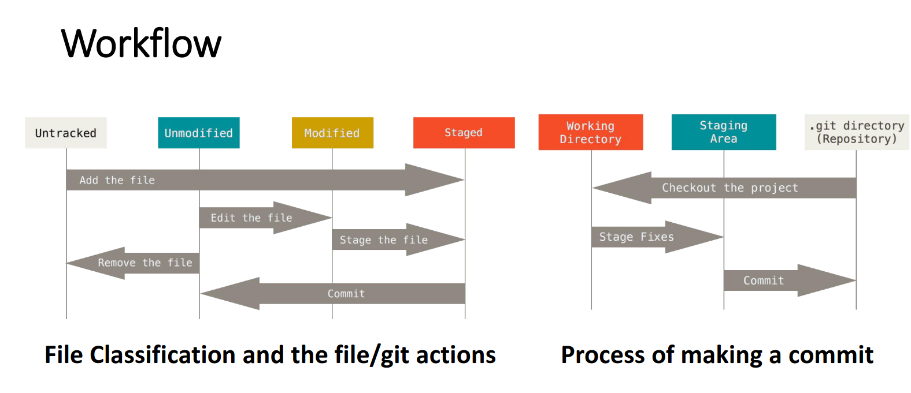

- Newly created files are referred to untracked files.
- These new files need to be added to the version control so that the git repo knows they are meant to be tracked.
- Any edited file is called a modified file.
- The modified file need to be "staged" before it can be committed.
- At any point in time we can use `git status` command to see the current stage of the file we are working on.
- Once a change is being committed, we can push that change using the `git push` command.
- Other teammates or users can download the pushed changes using `git fetch` or `git pull` or `git clone`.
- Conflicts can occur while collaborating on a project.
- Conflict Resolution: Process of resolving conflicting changes between to change-sets, it is usually done manually.
- Commands that are useful for merging files and conflict resolution:
  - git merge.
  - git rebase.
  - git diff --> this command shows the differences between conflicting commits.
- The following is a simple workflow to start with git:
1. Create your directory or folder and make it you present working direcetory.
2. Initialize the directory to the VCS by invoking the command `git init`.
3. Set your committer information using:
  > git config --global user.email "you@example.com"
  > git config --global user.name "Your Name".
4. You may want to create a README.md file, you can do so by using `touch README.md` or `vim README.md`. Don't forget all commands here are applied on linux machine.
5. Add the files to the version control by invoking the command `git add README.md file.c file.h`.
6. Commit your changes locally, with a comment to briefly indicate the reason behind this commit: `git commit -m "Creating the first commit".
7. If you want to create a new development branch rather than the master branch: `git branch your_chosen_branch_name`.
8. Checkout this branch after you create it in order to work in this branch: `git checkout your_chosen_branch_name`.
9. To get back to the "master branch": `git checkout master`.
10. To know the status of your files at any change: `git status`.
11. To merge two branches together (e.g.: the master and your newly created branch): `git merge your_chosen_branch_name`.
12. If you want to save your repo on a repository store site like github, you need to set up an empty repository then push your developed commits:
  > git remote add origin https://github.com/WHATEVERTHEACCOUNTNAMEIS/WHATEVERTHEREPONAMEIS.git
  > git push -u origin master.
