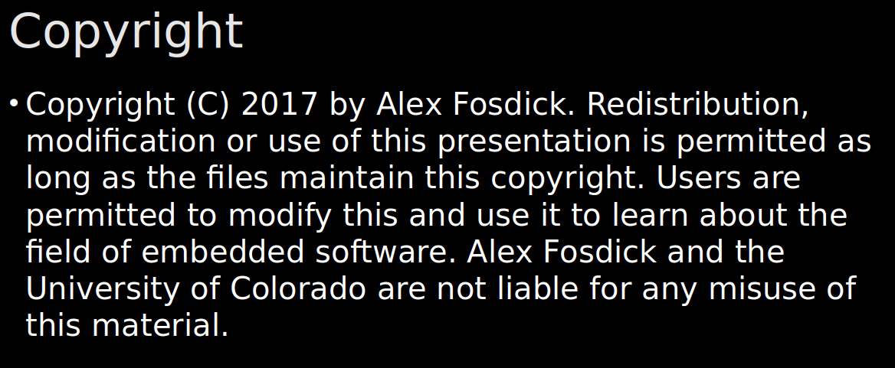

# Introduction to Embedded Systems Software and Development Environments

This repo contains notes and programming assignments for the Coursera's "[Introduction to Embedded Systems Software and Development Environments](https://www.coursera.org/learn/introduction-embedded-systems)" course by University of Colorado Boulder.

Date: March, 2022.

- The course is instructed by Eng. Alex Fosdick.

- You can find the **[syllabus](Syllabus.md)** of this course.
 
- The [**Certificate**](https://github.com/renatosoriano/Coursera-Introduction-to-Embedded-Systems-Software-and-Development-Environments/blob/master/Certificate.pdf) is available.

- The [**Notes for Week 1: Embedded System Development Components**](https://github.com/renatosoriano/Coursera_Introduction-to-Embedded-Systems-Software-and-Development-Environments/tree/master/Course%20Notes/1-%20Embedded%20System%20Development%20Components) are available. 

- The [**Notes for Week 2: Compilation With GCC and GNU Make**](https://github.com/renatosoriano/Coursera_Introduction-to-Embedded-Systems-Software-and-Development-Environments/tree/master/Course%20Notes/2-%20Compilation%20with%20GCC%20and%20GNU%20Make) are available.

- The [**Notes for Week 3: Memory Types, Segments, and Management**](https://github.com/renatosoriano/Coursera_Introduction-to-Embedded-Systems-Software-and-Development-Environments/tree/master/Course%20Notes/3-%20Memory%20Types%2C%20Segments%20and%20Management) are available.

- The [**Coding Exercises**](https://github.com/renatosoriano/Coursera_Introduction-to-Embedded-Systems-Software-and-Development-Environments/tree/master/Assignments) are available. 

- The [**Output Results**](#exercises-outputs) are available.

## Descriptions

This class is 9 Hours: 

Each assignment has requirements and some instructions to follow.
As a consequence, the assignments have implemented code and followed instructions given by the teaching staff with the requirements.

Most images I used in the course notes are from the course slides.

## Requirements

**[Ubuntu](https://ubuntu.com/download/desktop)** - All the code/debug were done on this Environment. \
**[VirtualBox](https://www.virtualbox.org/wiki/Downloads)** - If you have Windows or Mac, you need to setup VirtualBox. \
**[VMware Workstation](https://www.vmware.com/products/workstation-pro/workstation-pro-evaluation.html)** - Or setup VMware. \
**[Parallels Desktop](https://www.parallels.com/products/desktop/)** - My recommendation for Mac users. \
**[Sublime Text](https://www.sublimetext.com/3)** - Any code editor but sublime is a better choice for Ubuntu and Windows. \
**[Visual Studio Code](https://code.visualstudio.com/)** - My recommendation due to the integration of GitHub in the same coding IDE.

## Exercises Outputs

### [Assignment 1](https://github.com/renatosoriano/Coursera_Introduction-to-Embedded-Systems-Software-and-Development-Environments/tree/master/Assignments/C1M1):  

- In this programming assignment we will create a simple application that performs statistical analytics on a dataset.
- Functions that can analyze an array of unsigned char data items and report analytics on the maximum, minimum, mean, and median of the data set. 
- In addition, we will need to reorder this data set from large to small. All statistics should be rounded down to the nearest integer. 
- After analysis and sorting is done, we will need to print that data.

#### <ins>Output</ins>:  

_Note: Click on each image for better visibility._

`Compiling code and execution`:

### [Assignment 2](https://github.com/renatosoriano/Coursera_Introduction-to-Embedded-Systems-Software-and-Development-Environments/tree/master/Assignments/C1M2):

- In this programming assignment we will create a build system using the GNU tools, GCC and GNU Make. 
- This assignment will require to compile multiple files, link them together and create a final output executable. 
- We will need to support two platforms; the host environment and the target embedded system MSP432. 
- The host system will allow you to simulate software on a host platform. 
- The target system will be used in upcoming assignments as we begin to create our microcontroller applications.

#### <ins>Output</ins>:  

_Note: Click on each image for better visibility._

`PLATFORM=HOST`:

`PLATFORM=MSP432`:

`make clean`:

### [Assignment 3](https://github.com/renatosoriano/Coursera_Introduction-to-Embedded-Systems-Software-and-Development-Environments/tree/master/Assignments/C1M3):

In this programming assignment you will need to analyze some allocated memory. 

You will need to specify where the listed symbols will be placed in the program. Once you have figured out your memory space, you can take the Programming Assignment Quiz where you will provide details about specific symbol elements including:

- Location Top segment or Type - Code, Data, Peripheral, Register, None.
- Location Sub-segment - Stack, Heap, BSS, Data, const/rodata, None.
- Access Permissions  - Read (R), Write (W) Read-write (RW), None.
- Lifetime - Function/Block, Program, Indefinite, None

#### <ins>Output</ins>:  

_Note: Click on each image for better visibility._

`PLATFORM=MSP432`:

### [Final Assignment](https://github.com/renatosoriano/Coursera_Introduction-to-Embedded-Systems-Software-and-Development-Environments/tree/master/Assignments/Final_assessment/course1):

In this programming assignment you will:

- Write more C-programming code and integrate code with the build system. 
- Reuse version control repository and add some new c-programming functions that manipulate memory.
- Test code on the host machine and should compile for both the target platform and host platform. 

#### <ins>Output</ins>:  

_Note: Click on each image for better visibility._

`VERBOSE = DISABLED`:

`VERBOSE = ENABLED`:

`VERBOSE = ENABLED (continuation)`:

`VERBOSE = ENABLED (continuation)`:

